# Reel Factory

Add product photos, video clips and a few facts in the browser, or use the CLI. You get a
narrated vertical video with on-screen text and a ready-to-paste Facebook
caption — in Hindi and English, from the same source material.

Watch a playable draft, pause on a scene to change its media or words, and
refresh the preview before building the finished reel.

Video rendering happens on your machine. Cloud script writers, online voices,
stock searches, and optional photo analysis use external services. The default
`edge` voice requires internet access; see [Privacy and offline use](#privacy-and-offline-use).

Start the browser workspace after installation: `python -m reelfactory serve`,
then open `http://127.0.0.1:5000`.

For the code structure, data storage, and end-to-end flow, see
[Architecture and how it works](#architecture-and-how-it-works).
For a screen-by-screen guide, see the [Visual walkthrough](#visual-walkthrough).

Architecture diagrams: [HLD](#hld-system-boundaries-and-services) ·
[LLD modules](#lld-module-connections) · [Data model](#lld-core-data-contracts) ·
[Request sequence](#lld-script-to-video-request-sequence) ·
[Photo-context lifecycle](#lld-photo-context-and-collection-lifecycle).

See the [feature checklist](FEATURE_CHECKLIST.md) for the 15 September 2026
audit: verified flows, bugs fixed, live provider results, and remaining limits.

---

## 1. Install (once)

Run commands from the repository root. You need Python (the audit used 3.12),
FFmpeg and ffprobe on PATH, and fonts for the languages you render.

**Windows:** double-click `setup_windows.bat`. It checks Python, installs
FFmpeg via winget if missing, and installs the Python packages. If it installs
FFmpeg, open a new terminal and run the setup script again.

**macOS / Linux:** install FFmpeg first, then run `bash setup.sh`.
Use `python3` instead of `python` below if that is your interpreter command.

For an isolated Python environment (recommended), create and activate it before
running setup or installing requirements:

```powershell
# Windows PowerShell
python -m venv .venv
.\.venv\Scripts\Activate.ps1
python -m pip install -r requirements.txt
```

```bash
# macOS / Linux
python3 -m venv .venv
source .venv/bin/activate
python -m pip install -r requirements.txt
```

Check the installation:

```text
python --version
ffmpeg -version
ffprobe -version
python -m reelfactory --help
```

If `brand.yaml` does not exist, copy `brand.example.yaml` to `brand.yaml` and
edit it. Do not overwrite an existing client's configuration. The product paths
in this guide are examples, not bundled demo assets: create a product in the
browser or follow step 3 before running a build.

### What works today

- Hindi and English scripts, narration, on-screen text, and captions.
- Four output shapes: `9:16`, `1:1`, `4:5`, and `16:9`.
- Three visual templates, product photos and clips, music, and brand styling.
- Playable reel previews with scene seeking and picture, video, narration and caption editing.
- Video uploads and mixed photo/video scenes, with clips trimmed or looped to fit.
- Named saved scripts, photo analysis snapshots, and hook variants.
- Batch CLI rendering and a calendar with folder export or dry-run publishing.

Facebook, Instagram, and YouTube publishing are **not connected**. Upload the
finished files manually. Avatar generation, catalog imports, and performance
analytics are not implemented; proposed work is documented in the
[audit and market assessment](AUDIT_REPORT.md).

## Prefer a browser?

Start the local workspace instead of editing YAML by hand:

```
python -m reelfactory serve
```

Open `http://127.0.0.1:5000`. It lets you create products, upload and order
photos or clips, find stock images, edit scripts line by line, choose a visual
look, compare opening-line variants, and watch and revise a reel preview before
building the final video. Everything still stays
on your machine except the cloud features you explicitly choose: AI script/TTS
requests, stock-photo searches, and the **Analyze photos** action described
below.

On Windows, `start_windows.bat` also starts Ollama when installed. Its restart
helper checks the listening process before stopping it; an unrelated program
on the required port is left running and startup stops with an explanation.
Use `python -m reelfactory serve --port 5001` if another program needs port 5000.

Keep the server bound to `127.0.0.1`. This is a local workspace, not a hardened
public hosting service; do not expose the development server or debug mode to
the internet.

Browser changes require a session CSRF token; foreign-origin requests and unknown
Host headers are rejected. Upload requests are limited to **256 MB**, including
all files in the request. Brand asset URLs serve supported files only from the
workspace's `logo/` and `music/` directories. External paths can still be used by
local rendering, but the browser cannot download them through those URLs.
Concurrent builds reserve separate video names and publish completed files
atomically. Collection metadata updates and shared caption writes are serialized
so overlapping requests do not overwrite each other's work.

Failures are recorded in `logs/reelfactory.log` beside `brand.yaml`, including
timestamp, request reference, route and traceback. Internal error pages show
the matching reference; every response also has an `X-Request-ID` header.
Logs survive restarts and rotate at 2 MB, keeping five older files. Request
bodies, query strings and headers are not logged, and configured secrets are
redacted. Logs stay local and are excluded from Git.

### Create and revise a reel

To feature several products in one video, tick **Select** on their dashboard cards
and click **Choose photos** in the **One reel, multiple products** bar. Select at
least two products with photos. On the next page, tick only the photos you want
from each product, keeping at least one per product, then click **Create reel**.
The first photo of each product is selected initially. The script editor
opens with a shared introduction, one connected scene per selected product
(in dashboard order), and one closing invitation. Collections default to
awareness: introduce what the business offers and weave the range into one
story instead of reciting separate sales pitches, prices, and specifications.
Use Gemini, Inception or the local writer for a tailored story; the built-in writer gives
a simple guided tour. Use **Rewrite with instructions** to suggest a scenario
or audience grounded in the supplied product facts.
Review the Hindi and English scripts, reorder scenes if needed, and build as
usual. Each output language and shape contains all selected products together.
The collection is saved as a separate dashboard entry with copied media and
details; later changes to the original products do not update that draft.
Only the selected photos and their available visual notes are copied. Complete
product settings are preserved per product, including
specifications, offers, audience, proof, required phrases, and words to avoid.
Fresh photo observations are included when available. Gemini, Inception and the local
writer receive these separate records for generation and rewrites; configured
product scripts are reference copy, not replacements for the collection script.
The collection plan requires a shared hook, one named scene per product, and
one shared CTA. Photo choices account for the opening so product scenes stay
paired with the correct product images.

1. Create a product through **Basics → Photos → Details**. Add selling points
   for the languages you need. Upload images or clips, order them with arrows,
   drag them, or edit their position numbers, then save. Saving keeps the current step.
2. Open **Build a reel**. Choose the language and writer, then generate a draft
   on **Script**. Hindi and English have separate tabs so only one editor is
   visible at a time. Both remain part of the draft.
3. Use **Edit scene** to choose or upload a picture or video and edit its spoken
   line and on-screen text. **Add video scene** inserts a clip before the closing
   scene. Scene arrows move words and media together; add or remove scenes as needed.
4. Open **Rewrite with instructions**, describe the change, and choose whether
   to rewrite one language or both. Gemini, Inception and the local writer receive
   the original draft, scene media names, product facts, brand details, and
   current photo analysis as context. A failed rewrite keeps your working draft
   and instructions. The built-in writer uses fixed patterns and cannot follow
   free-form instructions; choose an AI writer for this action.
5. Open **Save a version** to name and save the draft. Load it later from
   **Saved scripts for this product**. Saving retains words, image choices,
   writer and instructions. Deleting a saved version keeps your current draft
   and returns to Script. Saving is explicit; do it before leaving the page.
6. Click **Preview reel** on Script to watch the current language's draft.
   **Voice & video settings** opens Review, where you can choose narration,
   music and appearance. Return to Script, pause the player or jump to a scene,
   and click **Edit this scene**. Apply edits and click **Refresh preview** to
   watch the updated reel. See [Watch and edit a preview](#watch-and-edit-a-preview).
7. On **Review**, choose final output shapes and quality, then **Build video**.
   Play the result, save the video,
   and copy its caption. Earlier outputs are under **Finished videos and captions**.

To compare openings, generate variants, tick at least one for each selected
language, and confirm the selection. Selecting multiple versions builds each
one; a render failure keeps those selections available to retry.

Photo-quality advice stays compact: use **View photo issues** on an uploaded
photo or **Review photo quality** on the build page to open the details in a
popup. Close it with Close, Escape, or a click outside.

**More script actions → Clear current draft** clears the editor.
**Saved scripts for this product → Manage saved scripts → Clear all saved scripts**
clears that product's saved library. Both ask for confirmation and stay on Script;
neither deletes product media or finished videos. Finished files have their own
selection and delete controls.

Only chosen scene media appears in an edited script's video. If a chosen file
has since been deleted, the renderer falls back to an available product image.
Bold and Premium replace the last scene's image with a brand end card; choose
Classic to keep the selected image in that scene.

### More natural narration

Under **Narration**, try Normal or Relaxed pace for Edge.
Gemini defaults to conversational delivery and accepts custom tone and pace
instructions (requires a Gemini API key). Voice quality still depends on the
provider, chosen voice and script; listen to a rendered sample to judge it.
Only controls supported by the selected provider are shown. Brand settings
hold the persistent voice names; the build page can override pace and delivery.
Set **Brand → Voice → Default narration** and **Gemini delivery instructions**
to choose the starting voice provider and delivery for new browser builds.

Live checks produced playable English and Hindi audio from Edge, gTTS and
Gemini. This confirms service operation, not a subjective naturalness score.

### Privacy and offline use

| Feature | Network/data behavior |
| --- | --- |
| Template scripts and FFmpeg rendering | Run locally. |
| `--script local` | Sends product context to the configured model endpoint. It stays local only when that endpoint is local; download the model beforehand. |
| `--script ai` | Send script context to the selected cloud provider. |
| `--tts edge` / `gtts` / `gemini` / `elevenlabs` | Send narration text to an online voice service. |
| Analyze photos | Sends selected supported images to Gemini when requested. |
| Stock search/download | Contacts Pexels/Pixabay and downloads selected media. |

For a visual-only draft without network services:

```text
python -m reelfactory build products/iron-shelf-5-tier --script template --tts silent --no-music --preset ultrafast
```

`silent` produces no spoken narration. Cloud service availability, costs, and
quotas depend on the provider. Review generated copy and photo descriptions
before publishing: prompt instructions are not factual verification. Keep keys
in environment variables or a private `.env` beside `brand.yaml`; never commit
credentials. See `.env.example` for supported settings.

Open **API settings** in the top navigation to configure Gemini, Inception,
local models, ElevenLabs, Pexels or Pixabay. Choose a service in the provider
list, enter its key, and save. Each provider saves independently, and switching
providers keeps your unsaved edits. Model names and connection URLs are under
**Model & connection**; optional backup keys have their own section.
Keys stay in the project's local `.env`; model settings used by
Brand are saved in `brand.yaml`. Saved keys are masked: a blank field keeps
the current key, and **Remove saved key on save** deletes it. **Show** reveals only
the key you are currently entering. Environment variables
still take precedence. New requests read saved changes without restarting;
saving does not test credentials or make a paid API request. This remains a
local, single-user app, not an authenticated public configuration service.

**For Hindi on-screen text** you need a Devanagari font. Windows 10/11 already
has *Nirmala UI*. Otherwise install
[Noto Sans Devanagari](https://fonts.google.com/noto/specimen/Noto+Sans+Devanagari).
If the font is missing, the tool warns you and the Hindi text renders as boxes —
the voiceover is unaffected.

For the English look, install [Montserrat](https://fonts.google.com/specimen/Montserrat)
or [Poppins](https://fonts.google.com/specimen/Poppins). Without them it falls
back to a system font, which is fine but plainer.

---

## 2. Set up the client (once per client)

Edit `brand.yaml`: business name, city, phone, colours, and optionally a logo
PNG and a background music track.

Use music you have permission to include in the intended advertisement and
distribution channels. Review the track's license and retain its source details.

---

## 3. Add a product (once per product)

```
products/
  iron-shelf-5-tier/
    product.yaml
    photos/
      1.jpg   2.jpg   3.jpg   4.jpg   5.jpg
```

Photos are used in filename order, so number them in the order you want them to
appear. Five to eight good photos is the sweet spot.

**Photo size and shape is the single biggest thing you control.** A reel is
tall (9:16), and each photo is centre-cropped to fill it and then slowly zoomed
into. So:

- **Shoot portrait.** A landscape photo keeps only about a third of its width —
  whatever was at the sides is simply not in the video.
- **Shoot big.** 1404×2496 or larger stays sharp all the way through the zoom.
  Anything smaller is being enlarged, and "the video looks blurry" is nearly
  always this.

The tool tells you when a photo falls short — on the product page next to the
photo itself, on the build page before you spend the time, and in the terminal
during a build. It never stops you; a soft photo still makes a video.

To use a different order without renaming files, list the filenames under
`photo_order:` in `product.yaml` (the web UI writes this for you when you drag
the photos around). Anything you leave out of the list follows it in filename
order, so adding a photo never means rewriting the list.

### Let the script writer understand the photos

Uploading a photo does not silently send it anywhere. After saving the product,
use **Photo understanding → Analyze photos** on its edit page when you want
Gemini to describe the still images. This requires `GEMINI_API_KEY` and uses
the `gemini_script_model` setting (`gemini-2.5-flash` by default).

The analysis produces a short description for every JPG, PNG or WebP and one
combined visual summary. Review and edit the combined summary on the same page.
Analysis is guided by the advertised product's name, selling points, specs,
audience and goal. Each description focuses on relevant visible product details
and suggests how the shot can support the ad. The overall context connects the
views into a possible product story. Suggested uses are creative guidance;
photos do not establish technical claims or benefits absent from the brief.
Each description is saved automatically in `photo_analysis.yaml` beside
`product.yaml`, followed by the overall context built from all descriptions.
**Update photo context** reuses descriptions of unchanged photos, analyzes new
or replaced photos, and rebuilds the overall context from the full current set.
Completed descriptions remain saved if a later analysis or combining request
fails. Changing the analysis model or advertising brief refreshes descriptions
on the next update; older generic analyses also refresh once. API quota is
used only for these explicit actions, not on every script generation.

Use **Save for future** to give the current analysis a name. These product-local
snapshots are kept in `saved_photo_summaries.yaml` with the per-photo summaries
and SHA-256 fingerprints, and can be restored or deleted from the Photos step.
Restoring a snapshot made from different photo files marks it **Refresh needed**
and keeps it out of prompts, even if the filenames happen to be the same.

Every AI writer (Gemini, Inception or a local model) receives every current photo's
description together with the combined product context through the shared
script prompt. The offline template writer does not
use it. The prompt labels the descriptions as visual observations and forbids
turning them into unsupported claims about material, capacity, price, warranty,
or performance.

The cache records a SHA-256 fingerprint for every analyzed image. Adding,
deleting, or replacing a photo—even under the same filename—marks the analysis
**Refresh needed** and keeps it out of prompts until it is regenerated. Video
clips and BMP files remain usable in the reel but are not sent for analysis.
Inline analysis accepts files below 12 MB each.

### No photos of your own? Fetch free ones

`reelfactory photos` searches Pexels and Pixabay and drops the results
straight into a product's `photos/` folder. Review each asset's license and
restrictions before publishing; a search result is not blanket clearance for an
advertisement. Use actual product photos when a stock image could misrepresent
what the client sells:

```
# see what a search finds, download nothing
python -m reelfactory photos products/iron-shelf-5-tier -q "steel shelving" --list

# fetch six, skipping anything too small to stay sharp in a reel
python -m reelfactory photos products/iron-shelf-5-tier -q "steel shelving" -n 6 --sharp

# just fill a folder, no product involved
python -m reelfactory photos --to ./scratch -q "grocery store aisle" -n 20
```

Every result is measured *as it will arrive on disk* and run through the same
"will this look soft in a reel" rule as the photos already in a product, so
the sizes printed next to the results mean exactly what the warnings on the
product page mean. Photos are added after the ones already there and never
overwrite them. Where each came from is recorded in `photo_credits.yaml` next
to `product.yaml` so you retain the source information for later review.

The web UI has the same thing on the product's **Photos** step: *Find free
stock photos* → search → tick the ones you want.

| Flag | Default | Notes |
|---|---|---|
| `--query` / `-q` | required | plain words work best: `"grocery store aisle"` |
| `--count` / `-n` | `8` | how many to fetch |
| `--source` | both | `pexels`, `pixabay`, or both |
| `--orientation` | `portrait` | reels are tall; `landscape`, `square` and `any` also work |
| `--sharp` | off | skip anything the render would have to blow up |
| `--list` | off | show the results and download nothing |
| `--to` | — | a plain folder instead of a product |

**Set up a key once.** Both are free and take about a minute
([Pexels](https://www.pexels.com/api/),
[Pixabay](https://pixabay.com/api/docs/)). Either one on its own is enough;
with both, results from the two are interleaved. Put them in the `.env` next
to `brand.yaml` (see `.env.example`) or set them as environment variables:

```
PEXELS_API_KEY=your-key-here
PIXABAY_API_KEY=your-key-here
```

Like every other key here, they are never read from `brand.yaml`.

One thing to know: Pixabay's public download is capped at 1280px on the long
side, so its photos are usually flagged as too small for a reel even though
its API describes a much larger original. Pexels serves the full-size file.
With `--sharp` on, most of what survives will be from Pexels.

**Short clips work too.** Drop an `.mp4`, `.mov`, `.m4v` or `.webm` into the same
`photos/` folder and it is used like any other shot — three seconds of someone
handling the product is worth several stills. A clip keeps its own movement
instead of getting a camera move, is trimmed to fit its slot (or looped if it is
shorter), and its sound is dropped, since the voiceover owns the soundtrack.
In the browser, use **Add video scene** or **Edit scene → Upload video**;
see [Add videos to a reel](#add-videos-to-a-reel) for the full workflow.

Create `products/iron-shelf-5-tier/product.yaml` with your own verified facts:

```yaml
name_en: "Five-tier shelf"
name_hi: "पाँच शेल्फ वाला रैक"
usp_en:
  - "Five shelves for everyday storage"
usp_hi:
  - "रोज़मर्रा के सामान के लिए पाँच शेल्फ"
```

Both names are required. Supply benefit lines in each language you intend to
render, and place your media in the sibling `photos/` directory.

**Preview the copy before spending render time:**

```
python -m reelfactory script products/iron-shelf-5-tier
```

That prints the full narration, the on-screen text and the caption for both
languages. Edit `product.yaml` and re-run until it reads well.

---

## 4. Build

```
# both languages, vertical
python -m reelfactory build products/iron-shelf-5-tier

# every product in the folder, vertical + square
python -m reelfactory build products --aspect 9:16,1:1

# Hindi only, quick draft to check the timing
python -m reelfactory build products/iron-shelf-5-tier --lang hi --preset ultrafast
```

No logo ships with the project. Drop the client's logo (a transparent PNG works
best) next to `brand.yaml` and point `logo:` at its filename, or leave
`logo: null` to go without — `watermark: true` then shows the brand name
faintly instead.

Output lands in `out/<product>/`:

```
iron-shelf-5-tier_hi_9x16.mp4      <- Facebook Reel / Story
iron-shelf-5-tier_en_9x16.mp4
iron-shelf-5-tier_hi_caption.txt   <- paste into the post
iron-shelf-5-tier_en_caption.txt
```

Building the same thing again never overwrites what is already there — the
second render of a product/language/shape is saved as `..._9x16_2.mp4`, the
third as `_3`, and so on. Tweaking a line and rebuilding therefore cannot cost
you the take you preferred; delete the ones you don't want when you're done
(the web UI has a button for it).

Expect roughly one to three minutes per video on a normal laptop. Use
`--preset ultrafast` for drafts and the default for the version you post.

### Options

| Flag | Default | Notes |
|---|---|---|
| `--lang` | `hi,en` | `hi`, `en`, or both |
| `--aspect` | `9:16` | `9:16` reels, `1:1` feed, `4:5` feed, `16:9` |
| `--tts` | `edge` | `edge`, `gtts`, `gemini`, and `elevenlabs` need internet; `silent` makes a visual draft without narration |
| `--script` | `template` | `template` (offline, free), `ai` (Gemini), `inception` or `local` (written by a model running on your machine) |
| `--preset` | `medium` | `ultrafast` for drafts, `slow` for final quality. Each preset carries its own quality level, so slower really does look better, not just take longer |
| `--crf` | from preset | override that quality. Lower is better and bigger: `16` excellent, `23` a rough draft |
| `--template` | inherited | explicit flag, then product setting, then brand default, then `classic`; bundled looks: `classic`, `bold`, `premium` |
| `--variants` | `1` | render N versions with different opening lines |
| `--no-music` | off | skip the background track |
| `--out` | `out/` | where finished files go |
| `--keep-temp` | off | keep intermediates when something looks wrong |

---

## Build in the browser

The Build page lets you read the script and watch a rendered reel preview before
the final export. You can edit narration,
on-screen text, line roles, and the photo or clip assigned to each line; the
result uses those exact edits. Use **See versions to compare** to choose one or
more script variants, then build the selected versions separately.

After writing or editing a script, use **Save to this product** to store a named
copy for later. Saved scripts live in that product's `saved_scripts.yaml` and
retain the language, writer, narration, overlays, roles, and photo selected for
every line. **Saved scripts for _product-name_** remains available on the Script
step so a stored draft can be loaded or deleted without generating it again.

The page also exposes the same render choices as the command line: language,
aspect ratio, script writer, voice, picture-quality preset, music, and visual
look. Leave **Visual look** on its default to use the product setting, then the
brand default, then `classic`.

### Watch and edit a preview

1. Generate or load a script and open its language tab on **Script**.
2. Under **Watch & edit your reel**, choose a **Preview shape** and click
   **Preview reel**. Keep the page open while it renders; an elapsed timer shows
   progress. The preview includes the selected voice, captions, transitions and music.
3. Play or scrub the video, or use the numbered scene buttons to jump into a
   scene. Click **Edit this scene** to change its picture or video, narration,
   or on-screen caption, then **Apply to scene**.
4. Click **Refresh preview** to render those changes. The old video remains
   visible until the new preview succeeds. When the draft differs from the
   video, the page marks it as needing a refresh and disables editing by playback
   position so reordered scenes cannot be mistaken for the old ones.
5. Save a named script version to keep the draft for later. Once satisfied,
   go to **Review & build** and click **Build video** for the final export.

Previews render one language and shape at a time, at up to 640 pixels on the
long edge. Final builds use the chosen output shapes and quality. Preview shape
does not change the final output selection. Each preview uses the current voice
provider, so online voices still need internet and may use provider credits.
Use **Voice & video settings** to change the voice, music or visual look.

Previewing requires a spoken line and an available picture or video for every
scene; fill in or remove blank scenes first. Failed renders keep your draft and
any previous playable preview. Saving a script preserves the edits, while the
preview player belongs to the current page. Previews do not overwrite finished
exports or appear in **Finished videos and captions**.

After a successful render, the cache keeps the latest **three** completed previews
per product and removes completed previews older than a day. Failed renders are
cleaned up without evicting your previous preview. Use **Clear cached previews**
to reclaim space immediately; active renders and finished exports are preserved.
Older preview tabs may need a refresh after their cached video is removed.

### Add videos to a reel

- **Insert a scene:** click **Add video scene**, choose an existing video or
  **Upload video**, add the scene's narration and optional on-screen caption,
  then click **Add video scene** in the editor. It is inserted before the closing
  scene so a brand end card does not hide the new clip.
- **Replace scene media:** click **Edit scene** (or **Edit this scene** in the
  player), select **Upload video**, choose the clip and **Apply to scene**.
- **Find a clip:** set **Show media** to **Videos**. Media tiles label videos
  and pictures; the selected video has playback controls in the editor.

For collections, choose **Product shown in this scene** before adding a video.
The picker shows that product's media and assigns new uploads to it, so a clip
for one product cannot accidentally become another product's replacement.

Supported files are **MP4, MOV, M4V and WebM**. Image and video uploads are validated
before being accepted. Pictures and videos can share a reel;
videos retain their movement, start at the beginning, and are trimmed or looped
to match the scene's narration. Original clip audio is muted in the reel; your
selected narration and background music supply the soundtrack.

Cancelling keeps the original scene unchanged, or discards a newly added scene.
Uploaded files remain in the product library for reuse. **Refresh preview** to
watch the changes before building. Bold and Premium may use a brand card for the
closing scene; choose Classic if you want that scene to show its selected media.

---

## AI scripts and voice (optional)

### ElevenLabs narration

Set `ELEVENLABS_API_KEY=your-key` in the project's `.env` file (or your
environment). Keep API keys out of `brand.yaml`.

For automatic fallback, add a backup and optionally more keys in `.env`:

```dotenv
ELEVENLABS_API_KEY=your-primary-key
ELEVENLABS_API_KEY_BACKUP=your-backup-key
ELEVENLABS_API_KEYS=your-third-key,your-fourth-key
```

Keys are tried in that order, with duplicates removed. Environment variables
override the matching `.env` entries. You can also use `ELEVENLABS_API_KEYS`
alone. Authentication, credit, access, rate-limit, server and connection failures
retry the current line with the next key. The working key handles the remaining
lines in that synthesis call; completed lines are not generated again. Invalid
requests (HTTP 400/422) stop immediately so you can fix the text or settings.
If every key fails, the build reports the final error without exposing keys.
Each key must have access to the configured voice. Keys belonging to the same
ElevenLabs workspace share its [credit pool](https://elevenlabs.io/docs/overview/administration/workspaces/api-keys); a timeout retry can incur another charge
if the original request was already processed.

In **Brand → Voice**, enter an ElevenLabs voice ID for Hindi and/or English,
copied from your ElevenLabs voice library. Pick a Hindi-speaking voice for Hindi
scripts. Set **Default narration → ElevenLabs** to use it for new browser builds,
or select `elevenlabs` in the build page's Voice selector.

The same settings in `brand.yaml` are:

```yaml
elevenlabs_voice_hi: "YOUR_HINDI_VOICE_ID"
elevenlabs_voice_en: "YOUR_ENGLISH_VOICE_ID"
elevenlabs_model: "eleven_multilingual_v2"
```

```bash
python -m reelfactory build products/iron-shelf-5-tier --tts elevenlabs
```

The default model supports Hindi and English; `eleven_v3` can also be selected
by entering that model ID. This integration uses the
[ElevenLabs text-to-speech API](https://elevenlabs.io/docs/api-reference/text-to-speech/convert)
through the existing `requests` dependency. It requires internet and uses your
ElevenLabs account credits. Each narration line is generated separately, and its
audio duration drives video timing. Gemini delivery instructions and Edge pace
controls apply only to their respective providers. ElevenLabs captions currently
use the static overlay rather than word-by-word highlighting.

### Gemini narration and script writing

By default the tool writes copy from offline templates and speaks it with the
free `edge` voices. You can swap either piece for Gemini, independently:

```
# Gemini writes the script, edge-tts still speaks it (free)
python -m reelfactory build products/iron-shelf-5-tier --script ai

# templates write the script, Gemini speaks it
python -m reelfactory build products/iron-shelf-5-tier --tts gemini

# both
python -m reelfactory build products/iron-shelf-5-tier --script ai --tts gemini
```

**Set up the key once** (never put it in `brand.yaml` — it isn't read from
there, so it can't end up committed alongside a client's file). Easiest is a
`.env` file next to `brand.yaml`:

```
gemini_key=your-key-here
```

Or set an environment variable instead: `setx GEMINI_API_KEY "your-key-here"`
(then open a new terminal). Either way it can also be passed per-run with
`--gemini-key`.

**Temporary rate limits.** When Gemini returns HTTP 429 with a retry delay,
the app waits and retries the same request up to twice (at most 121 seconds
per wait). Narration continues from the current line. Daily or zero quotas
are not retried automatically; check [your project limits](https://ai.dev/rate-limit),
wait for the quota reset, or select Edge narration to build without Gemini TTS.

**Backup key (optional).** Free-tier Gemini projects have low quotas,
especially for TTS -- add a second key as `key_backup` in the same `.env`
file and it's used automatically, but *only* as a fallback when the primary
key specifically hits a quota / rate-limit error (HTTP 429), not for other
failures. Limits are per project, so a second key in the same project does
not add capacity:

```
gemini_key=your-primary-key
key_backup=your-second-key
```

**Inception script writing (English only).** Select Inception under **Who writes the
script** or **Rewrite writer**. It supports product and collection scripts,
extra instructions, rewrites and script comparisons. It receives the same
product facts, photo descriptions and advertising brief as the other AI writers.
Photo analysis and narration keep their separate providers.

Hindi generation with Inception is blocked because live roofing-script tests
still produced broken Hindi after editing. Choose Gemini or a Hindi-capable
local model for Hindi. Existing manually written or saved script overrides can
still be used. The app does not silently send a request to a different provider.

AI-generated Hindi scripts receive an additional editing pass for spoken Hindi
and on-screen captions, using the original brief. This costs one extra model
request per draft (including each compared version). Scene order and required
phrases are checked again. If the edit drops scenes or fails validation, the app
makes one additional repair request using the original draft and its exact scene
layout. A second invalid edit returns an error and preserves your existing draft.
Required scenes take priority over the approximate duration; for a short reel,
use fewer selling points or allow more time instead of expecting points to be merged.
Review the result before rendering: model editing cannot
guarantee correct grammar or verify real-world product claims. Existing saved
scripts are unchanged; rewrite them to apply the new pass.

Configure your local, git-ignored `.env` (see `.env.example`):

```dotenv
INCEPTION_API_KEY=your-inception-key
INCEPTION_MODEL=mercury-2.5
INCEPTION_BASE_URL=https://api.inceptionlabs.ai/v1
```

```powershell
python -m reelfactory build products/iron-shelf-5-tier --script inception --lang en
```

Model access and credits depend on your account. HTTP 402 means check billing
or credits; HTTP 429 means check quota and retry later. Dashboard checks only
confirm that a key is configured, without making paid API calls.
See the [Inception API docs](https://docs.inceptionlabs.ai/api-reference/chat/create-a-chat-completion).

**A local model is also supported for scripts.** With a downloaded model and a
local endpoint, script generation can stay on your machine. It talks to an
OpenAI-compatible local server, such as
[Ollama](https://ollama.com) or [LM Studio](https://lmstudio.ai):

```
# one-time setup:
winget install --id Ollama.Ollama -e   # installs Ollama and starts it as a background service
ollama pull llama3.2:3b                # ~2GB, a good fit for a 4GB laptop GPU

# then, any time:
python -m reelfactory build products/iron-shelf-5-tier --script local
```

Make sure the model server is running before using `--script local`.
By default it is called at Ollama's OpenAI-compatible
endpoint, `http://localhost:11434/v1`, and asked for the `llama3.2:3b`
model. Change either in `brand.yaml` (not secrets, so safe to commit/share):

```yaml
local_script_model: "llama3.2:3b"
local_base_url: "http://localhost:11434/v1"   # LM Studio default: http://localhost:1234/v1
```

If your GPU has more headroom, swap in a larger model
(`ollama pull llama3.1:8b`, then set `local_script_model: "llama3.1:8b"`)
for better writing quality at the cost of speed.

or override per-run with `--local-model` / `--local-url`. No key is needed
for most local servers; if yours requires one, pass `--local-key` or set
`LOCAL_LLM_API_KEY`. This is a script-only option. Pair it with
`--tts edge` for free narration that requires internet, or `--tts silent`
for a fully offline visual draft without narration.

**What each does:**

- `--script ai` sends the product's facts (price, warranty, USPs, phone...)
  to Gemini and asks it to write the hook/reveal/USP/proof/price/CTA lines --
  it's told never to invent facts, only to phrase the given ones. `script_hi`
  / `script_en` overrides in `product.yaml` still take priority over both
  modes, same as before.
- `--tts gemini` uses Gemini's own text-to-speech instead of edge-tts. The
  voice persona and both Gemini model names are set in `brand.yaml`:
  ```yaml
  gemini_script_model: "gemini-2.5-flash"
  gemini_tts_model: "gemini-2.5-flash-preview-tts"
  gemini_voice: "Kore"     # try: Puck, Charon, Fenrir, Aoede, Leda, Orus...
  ```

Preview an AI script without rendering (same as the normal preview, just add
the flag): `python -m reelfactory script products/iron-shelf-5-tier --script ai`

---

## 5. Post to Facebook

1. Facebook Page → **Create post** → **Reel** (or Photo/Video for the square cut)
2. Upload the `_9x16.mp4`
3. Paste the matching `_caption.txt`
4. Post the Hindi cut to the local audience; keep the English cut for a
   second post, a different Page, or a boosted ad

Post one language at a time rather than both at once — you learn which one your
audience responds to.

---

## What this video is for (intent)

`tone` only changes *how* the ad talks. `intent` changes *what it says and in
what order* -- which beats appear, what the hook leans on, how it closes. Set
it per product:

```yaml
intent: offer   # sell | offer | launch | awareness | footfall | enquiry |
                # restock | educate | festival
```

or as a brand-wide default that products inherit unless they say otherwise:

```yaml
# brand.yaml
default_intent: sell
```

or per run, without touching either file: `--intent footfall`. Run
`python -m reelfactory build --help` for supported options.

This tool was originally built around one kind of business (hardware /
furniture), with fixed fields for `material`, `sizes`, `warranty` and
`delivery`. It now generalises past that:

- **`specs` / `specs_hi`** — any other facts as a `label: value` mapping, for
  a business that isn't selling hardware:
  ```yaml
  specs:
    seats: 40
    cuisine: "Authentic Tamil Nadu style"
  ```
- **`category`** (also settable brand-wide) — picks better hashtags than the
  generic `#smallbusiness` set, e.g. `category: restaurant` pulls in
  `#restaurant #foodie #dineout`.
- **`audience`** — who the ad is speaking to, fed to the AI script modes as
  context (`--script ai` / `local`).
- **`offer`, `offer_ends`, `urgency`** — a deal and its deadline / scarcity;
  adds "offer" and "urgency" beats to the video automatically.
- **`proof_points`** — ready-made credibility lines ("4.8 stars from 200+
  reviews") for the "proof" beat, instead of only being built from `warranty`
  etc.
- **`cta_action`** — what the closing line asks for: `call`, `whatsapp`,
  `visit` (uses `brand.address` / `brand.hours`), `dm` (uses
  `brand.instagram`), `order_online` (uses `brand.website`), `book`,
  `comment`, or `auto` (the original phone/WhatsApp behaviour).
- **`must_say`** / **`avoid`** — phrases the AI script modes must work in or
  must never use.

None of this is required — a `product.yaml` with just `name_en` / `name_hi` /
one `usp_en` still works exactly as before, defaulting to `intent: sell` and
`cta_action: auto`.

---

## Changing how the ads look

`tone` and `intent` change the words. **Templates change the picture** -- how the
camera moves over each photo, how shots cut into one another, and how the photos
are graded. Three come with the tool:

| Template | Feels like |
|---|---|
| `classic` | Slow drift, soft crossfade, photos untouched. The original look. |
| `bold` | Fast slides, punchy colour, closes on a brand card. Suits offers and value ads. |
| `premium` | Slow dissolves, restrained colour, closes on a brand card. Suits premium and trust ads. |

`bold` and `premium` end on a **brand card** rather than on whichever photo the
slideshow happened to reach: the closing line lands centred and large on a card
in your `secondary_color`. `classic` keeps the original ending. Turn it on or
off per template with `end_card`.

Set it per product, as a brand-wide default, or for a single build:

```yaml
# product.yaml
template: bold
```

```yaml
# brand.yaml -- used by any product that does not pick its own
default_template: premium
```

```
python -m reelfactory build products/my-rack --template premium
```

Each one is a file in `templates/`. Copy any of them, change the numbers, and
the new name is available immediately -- no code to touch:

```yaml
description: "What this look is for"
moves: [in_center, out_center, in_left, pan_right, in_right, pan_left]
zoom: 0.30                    # how far the camera travels, as a fraction
transitions: [fade]           # cycled in order; any ffmpeg xfade name
transition_seconds: 0.5
grade: "eq=contrast=1.1:saturation=1.15"   # blank for no colour treatment
scrim: 0.78                   # darkness behind the text, 0 turns it off
crop_budget: 0.35             # how much of a photo a crop may discard
end_card: false               # close on a brand card instead of a photo
whoosh: 0.0                   # swish on each cut, 0 silences it
accent_hit: 0.0               # soft thump on the price beat, 0 silences it
match: 0.6                    # pull photos toward each other, 0 leaves them alone
```

**`match` is the one worth knowing about.** Client photos arrive from different
phones at different times of day: one warm, the next cool, one under-exposed.
Each is fine alone; cut together they look like several different shoots. Every
photo is measured, the set's middle becomes the target, and each is moved part
of the way there — part, and capped, so a photo that is *meant* to look
different is nudged rather than flattened. On the sample photos it pulls the
brightness spread in by about 60%. Set `match: 0` to leave photos exactly as
shot.

**Sound effects** are generated, not sampled -- there is no audio file to
license or ship. The swish is three bands of noise crossfaded low to high; the
accent hit is two low sines with a percussive decay. `bold` uses both, `premium`
only the hit, `classic` neither. Both are volumes from 0 to 1, so if they sit
too loud or too quiet under your voiceover, change the number.

The gradient behind the text is tinted with `secondary_color` from
`brand.yaml`, so the backdrop belongs to the brand rather than being flat black.

### Cutting on the beat

If you know your music track's tempo, say so and the cuts will land on it:

```yaml
# brand.yaml
music: music/upbeat.mp3
music_bpm: 96
music_offset: 0.0     # only if the track does not start on beat one
```

The pacing still follows the voice — only the silence between lines is
stretched or trimmed, by at most a quarter of a second, to bring each cut onto
the nearest beat. Words stay on their own pictures. Leave `music_bpm` at 0 and
nothing changes.

### Testing two openings

The first three seconds decide whether anyone keeps watching, so it is the part
worth testing:

```
python -m reelfactory build products/my-rack --variants 2
```

That writes the usual `_9x16.mp4` plus a `_9x16_v2.mp4` that differs only in its
opening line. Post one each week and keep the better one. Preview them without
rendering using `python -m reelfactory script products/my-rack --variants 2`.
If a product has a fixed `script_en` / `script_hi`, there is no opening to vary
and the extra variants are skipped.

---

## Changing how the ads sound

`tone: value | premium | trust` in `product.yaml` switches the opening hook.

To take full control of a specific product, set `script_hi` / `script_en` — a
list of lines, one per shot. That bypasses the templates entirely:

```yaml
script_en:
  - "This rack survived a full monsoon on an open terrace."
  - "Two millimetre iron, powder coated twice."
  - "Four thousand four hundred and ninety nine rupees, delivered free."
  - "WhatsApp us on 98765 43210."
overlay_en:
  - "One monsoon. No rust."
  - "2mm, double coated"
  - "₹4,499 delivered"
  - "98765 43210"
```

Different voices: `edge-tts --list-voices` lists every option. Set `voice_hi` /
`voice_en` in `brand.yaml`. `hi-IN-SwaraNeural` and `en-IN-NeerjaNeural` are
female; `hi-IN-MadhurNeural` and `en-IN-PrabhatNeural` are male.

---

## When something goes wrong

### Watch live debug activity

Click **Debug** in the top navigation. It opens `/debug` in a separate tab so
you can keep watching while a script, photo analysis or video build runs in
the main tab. The page refreshes every two seconds; select a previous request
to inspect it or turn off **Live updates** to pause the display.

The timeline shows stage starts/completions, elapsed time, writer/model choices,
photo-cache reuse, API attempts and HTTP status codes, quota waits, Hindi editing,
speech generation, scene rendering and output filenames. A handled failure is
marked **failed** even when the editor returns HTTP 200 to preserve your draft.
Elapsed time is measured time, not an estimated percentage complete.

Use **Download report** to export the retained activity as JSON. Match its
request reference to `logs/reelfactory.log` for the full redacted traceback.
The viewer retains the latest 100 requests with up to 200 events each and
resets on restart. Events also go into the existing rotating local log
(2 MB per file, five backups). Normal page reads and debug polling do not fill
the timeline; POST operations and recorded page failures do.

Stage events do not capture prompts, form bodies, API headers, raw model
responses or image data. Configured credentials are redacted from reports and
logs. Error summaries can contain a product name or other diagnostic context.
This is a read-only activity debugger, not an interactive Python console, and
does not require Flask's `--debug` mode. Live polling requires the normal
threaded server (`python -m reelfactory serve`); a custom single-threaded server
cannot answer the polling request while it is busy building.

Internally, `telemetry.py` emits optional stages through a request-local
`ContextVar`. `web/diagnostics.py` attaches a request ID and captures failures;
`web/debugger.py` stores bounded activity and serves `/debug`, `/debug/data`
and `/debug/download`. Instrumentation is inactive outside a traced request
and does not change provider selection or rendering behavior.

### Common errors

**"ffmpeg was not found"** — FFmpeg is not on PATH. On Windows,
`winget install Gyan.FFmpeg`, then open a *new* terminal.

**Hindi text shows as boxes** — no Devanagari font installed. See step 1, or set
`font_hi` in `brand.yaml` to a font you already have.

**"Edge TTS failed"** — no internet, or a firewall is blocking it. Try
`--tts gtts`, or `--tts silent` to check the visuals without a voice.

**Text runs off the screen** — shorten that USP in `product.yaml`, or set an
explicit short line in `overlay_hi` / `overlay_en`.

**Video feels too fast or too slow** — the pacing follows the voiceover, so
lengthen or shorten the lines. `rate_hi` / `rate_en` in `brand.yaml` change the
speaking speed (`+8%` is default; `-5%` is slower and calmer).

---

## Architecture and how it works

Reel Factory is a local Python application with two entry points: a Flask web
UI and a command-line interface. Both use the same product models, script
writers, voice generation and FFmpeg renderer. YAML and JSON files provide
persistence; there is no application database, message broker or background
render worker. Browser generation and builds run synchronously in the request.

### HLD: system boundaries and services

This is the high-level design: where the application runs, how users reach it,
what it stores, and which operations cross into external services. Boxes are
logical responsibilities, not independently deployed microservices.

[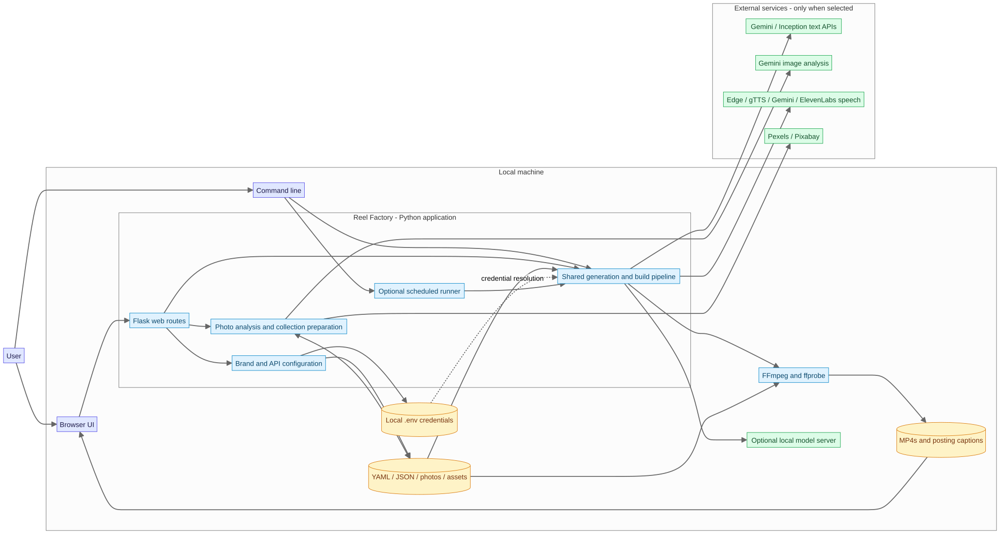](docs/architecture/hld-system.svg)

[Editable Mermaid source](docs/architecture/hld-system.mmd)

The built-in script writer does not call a text API. Script writing, image
analysis and narration are separate provider choices: selecting a script
writer does not select the voice provider or change Gemini photo analysis.
The diagram shows the main data/dependency paths; image and stock clients also
resolve credentials from the configured environment. Rendering stays local.

### LLD: module connections

The low-level design below maps responsibilities to the actual modules and
functions. The web layer calls the same orchestration functions as the CLI;
there is no second video engine hidden in the frontend.

[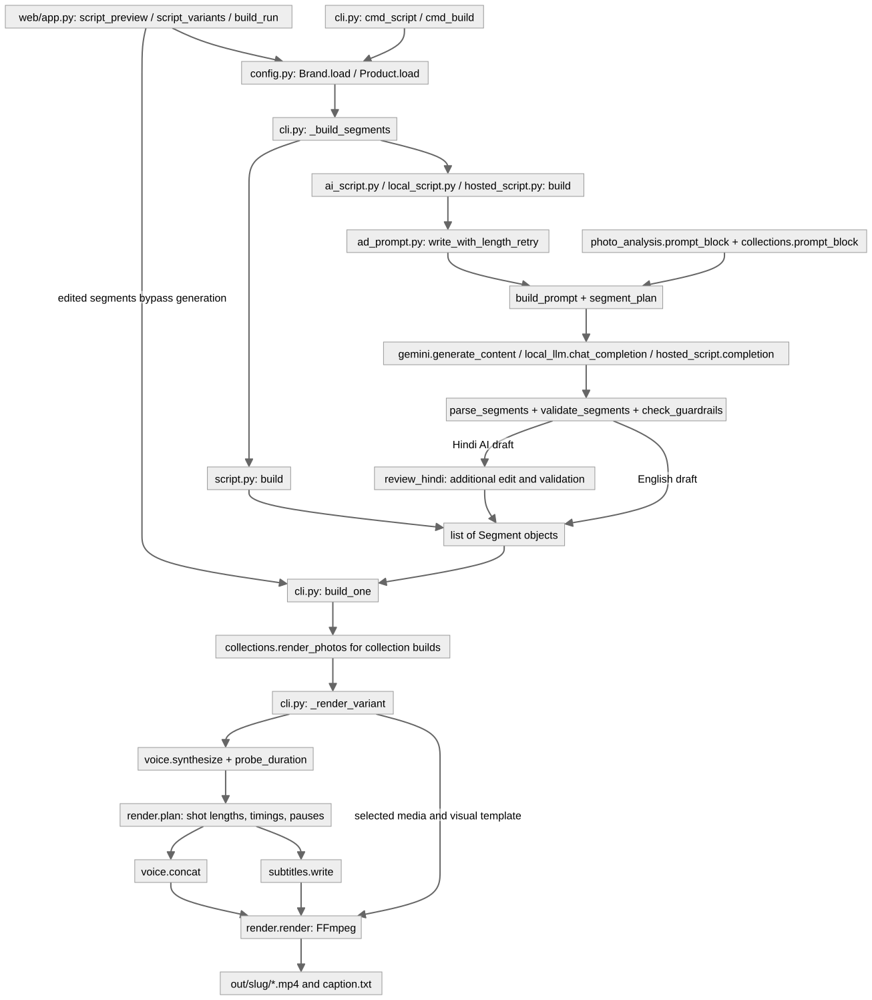](docs/architecture/lld-modules.svg)

[Editable Mermaid source](docs/architecture/lld-modules.mmd)

`collections.render_photos()` applies only to collections; ordinary products
use the normal filename/cycle mapping. An explicit saved script override can
bypass AI generation. Inception rejects new Hindi generation before making a
request. The shared validator may make bounded correction requests; the arrows
above show the successful path rather than every retry branch.

### LLD: core data contracts

These are selected fields from real Python dataclasses. The relationships
describe data transformation and use, not inheritance or database foreign keys.
The scene's index and separately stored photo filename connect speech, media
and captions; `Segment` itself does not contain a photo or duration.

[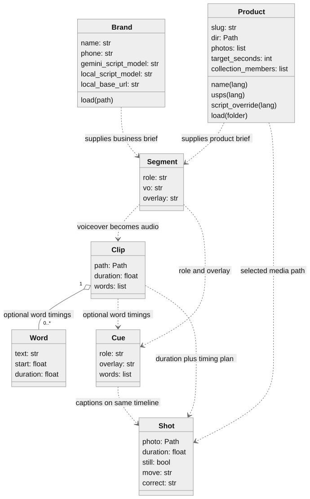](docs/architecture/lld-data-contracts.svg)

[Editable Mermaid source](docs/architecture/lld-data-contracts.mmd)

A collection member is a dictionary rather than a separate dataclass:
`{slug, facts, media, visual_context}`. Its `media` maps original filenames to
copied collection filenames. A saved script row is also a dictionary:
`{role, vo, overlay, photo}`. Saving serializes the editable scene/photo pairing;
the renderer later derives audio clips, timed cues and shots from it.

### LLD: script-to-video request sequence

This sequence distinguishes **writing** from **building**. The first request
returns editable copy. A later build request uses the submitted copy and photo
picks, so editing a line does not cause the writer to replace it during rendering.

[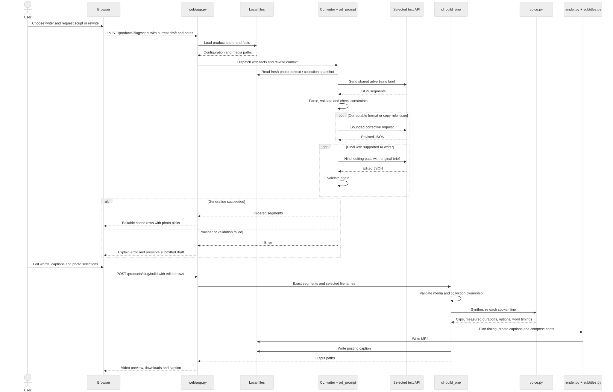](docs/architecture/lld-request-sequence.svg)

[Editable Mermaid source](docs/architecture/lld-request-sequence.mmd)

The speech backend and FFmpeg run within the build request; this is not a
queued background job. A failure stops the affected request. Neither the
browser nor the renderer is responsible for judging whether the model's prose
sounds human—that remains a writing/review concern before the build.

### LLD: photo context and collection lifecycle

This diagram explains where visual context comes from and why changing an
image or selecting only part of a product's gallery affects the script brief.

[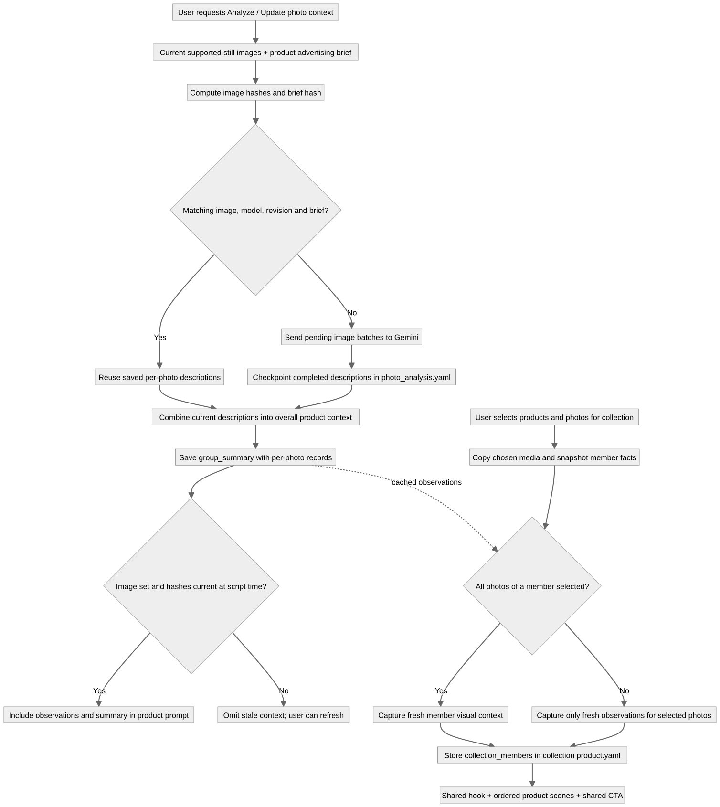](docs/architecture/lld-photo-context.svg)

[Editable Mermaid source](docs/architecture/lld-photo-context.mmd)

Cache reuse during analysis checks the advertising-brief hash, but prompt-time
freshness checks the image set and content hashes. Re-run analysis after changing
the brief. Collection snapshots are independent of later source-product edits.
Completed batch descriptions survive a later analysis failure, allowing a retry
to reuse that work. Named photo-summary snapshots are a separate user-triggered
save/restore layer around this cache.

### Reading the designs together

| Diagram | Question it answers |
|---|---|
| HLD | What runs locally, what is stored, and which services receive requests? |
| LLD modules | Which Python functions and adapters implement each operation? |
| LLD data contracts | What information crosses module boundaries? |
| LLD request sequence | In what order do writing, editing, synthesis and rendering occur? |
| LLD context lifecycle | How are photo descriptions reused and attached to collection members? |

These SVG diagrams display directly in the README without Mermaid support.
Click any diagram to open it at full size. Each has an editable `.mmd` source
in `docs/architecture/`. After editing a source, regenerate the images with:

```powershell
python -m pip install requests playwright
python -m playwright install chromium
python scripts/render_architecture.py
```

The renderer downloads pinned Mermaid 10.9.3 from jsDelivr and renders locally
with Chromium. The sections below expand the diagrams with file paths, route
tables and implementation limits.

### Repository structure

```text
reel-factory/
├── reelfactory/
│   ├── __main__.py          # python -m reelfactory entry point
│   ├── cli.py               # commands, provider dispatch, build orchestration
│   ├── config.py            # Brand/Product models, YAML loading and validation
│   ├── script.py            # offline copy, Segment model, posting captions
│   ├── ad_prompt.py         # shared advertising brief, scene plan, validation
│   ├── ai_script.py         # Gemini script adapter
│   ├── gemini.py            # Gemini HTTP, key resolution, quota/retry handling
│   ├── hosted_script.py     # Inception script adapter and HTTP calls
│   ├── local_script.py      # local script adapter
│   ├── local_llm.py         # OpenAI-compatible local server HTTP client
│   ├── photo_analysis.py    # per-photo descriptions and combined context
│   ├── collections.py       # product snapshots, selected media, scene ownership
│   ├── stock.py             # Pexels/Pixabay search and downloads
│   ├── voice.py             # speech clips, duration probing and audio assembly
│   ├── elevenlabs.py        # ElevenLabs speech integration
│   ├── subtitles.py         # caption layout and ASS subtitle files
│   ├── templates.py         # visual-template loading
│   ├── render.py            # shots, framing, motion and FFmpeg composition
│   ├── preflight.py         # dashboard readiness checks
│   ├── telemetry.py         # optional request-local stage events and timings
│   ├── calendar.py          # schedule entries and queue state
│   ├── runner.py            # prepare/render/publish scheduled entries
│   ├── publish.py           # dry-run/folder publishers and platform stubs
│   └── web/
│       ├── app.py           # product, collection, script and build routes
│       ├── api_settings.py  # API configuration page and local persistence
│       ├── diagnostics.py   # bounded, redacted request/error logs
│       ├── debugger.py      # live activity history, polling and JSON reports
│       ├── templates/       # Jinja HTML pages
│       └── static/          # browser interactions and CSS
├── templates/               # bold.yaml, classic.yaml, premium.yaml: video looks
├── products/                # product data and collection drafts
├── assets/                  # local brand assets where configured
├── out/                     # generated videos, captions and queue state
├── tests/                   # unit, web, provider and rendering regression tests
├── scripts/                 # browser/render/service audit helpers
├── brand.example.yaml       # starting brand configuration
├── .env.example             # supported environment settings, without secrets
├── requirements.txt         # Python dependencies
└── setup/start/schedule scripts for supported operating systems
```

The two `templates` directories have different purposes: root-level YAML
templates control the video look; `reelfactory/web/templates` contains web
pages. Runtime directories and files below are created as features are used.

### Where data is stored

| Location | Contents and responsibility |
|---|---|
| `brand.yaml` | Business details, contact information, voice/model settings, visual defaults and asset references. No API keys. |
| `.env` at the project root | Local API credentials and environment-based settings, including Inception's model/URL. Git-ignored. |
| `products/<slug>/product.yaml` | Product facts, language-specific copy, intent, target duration, photo order, optional script overrides and collection members. |
| `products/<slug>/photos/` | Uploaded/downloaded media, or selected media copied into a collection draft. |
| `products/<slug>/photo_analysis.yaml` | Image names and hashes, descriptions, combined summary, model, analysis revision, brief hash and timestamp. |
| `products/<slug>/saved_photo_summaries.yaml` | Named snapshots of photo-analysis results for reuse/restoration. |
| `products/<slug>/saved_scripts.yaml` | Named versions by language, including each scene's speech, caption and photo filename, plus writer and rewrite instructions. |
| `products/<collection-slug>/collection.yaml` | Source product slugs; detailed member snapshots are in the collection's `product.yaml`. |
| `out/<slug>/` | Rendered MP4s and `<slug>_<lang>_caption.txt`. Video names include language, aspect ratio and optional version suffixes. |
| `out/<slug>/.previews/<token>/<slug>/` | Separate video and caption files for each rendered preview; excluded from the finished-files list. |
| `calendar.yaml` | Optional publishing schedule. |
| `out/queue_state.json` | Scheduler status, attempts and results, separate from the schedule. |
| `to_post/` | Dated manual-upload packages produced by the folder publisher. |
| `logs/reelfactory.log` | Rotating web diagnostics beside the configured brand file, with secret redaction. |
| System temporary directory | Intermediate speech, combined audio, subtitle files and render assets. Normally cleaned after a build; `--keep-temp` retains them. |

CLI options can relocate the brand, products, output and scheduler paths.
The API settings page writes the project-root `.env` used by the current API
loaders; changing `--brand` does not relocate that credentials file.

### Product setup and visual context

1. The product editor saves facts to `product.yaml` and media to `photos/`.
   `config.py` loads these into a `Product`; brand settings load into `Brand`.
2. **Analyze photos** explicitly calls `photo_analysis.analyze()`. Supported
   still images are sent to Gemini with an advertising brief, so descriptions
   focus on the product's visible features and useful presentation angles.
   This is not automatic on every script request and does not analyze video clips.
3. Each result is associated with its filename and SHA-256 content hash.
   On an analysis run, cached descriptions are reused only when image content,
   model, analysis revision and advertising-brief hash match.
4. Completed batches are saved before the combined-summary request. A later
   API failure therefore does not discard already completed descriptions.
5. The combined summary is built from the descriptions of the current photos.
   Script prompts receive both the per-photo observations and that summary
   when the saved image set and content hashes are current. Missing or stale
   visual context is omitted. Re-run analysis after changing the product brief;
   the prompt freshness check itself checks image hashes, not the brief hash.

Product facts remain authoritative. A visible finish is not proof of a
material grade, warranty, load capacity or weather-resistance claim. Analysis
provides context to the writer, not verified specifications.

### Collection reels and matching products to photos

`collections.create_draft()` creates a new product folder for a collection.
It copies only the selected media, gives the copies collision-resistant names
based on product order/slug, and snapshots each member's facts and media mapping.
Later source-product edits do not automatically rewrite an existing collection.
Create a new collection to capture updated source facts or media.

For each member, the stored mapping connects the original filename to its
collection filename. When only some photos are selected, the snapshot includes
only their fresh individual observations, not an aggregate summary that could
describe excluded images.

The AI plan is **one shared hook → one product scene per member → one shared
CTA**. Each product scene names its member and draws claims from that member's
record. `scene_photos()` chooses media belonging to the correct member;
`render_photos()` validates edited scenes before synthesis/rendering and rejects
identifiable product/photo mismatches or missing selections. Ambiguous edited
copy can require an explicit photo choice: this is filename/product mapping,
not automatic visual understanding of the finished video.

### Script generation, rewrites and Hindi review

`cli._build_segments()` dispatches to the selected writer:

| Choice | Implementation | Behavior |
|---|---|---|
| `template` | `script.py` | Offline sentence templates; does not interpret free-form rewrite instructions. |
| `ai` | `ai_script.py` → `gemini.py` | Gemini writing using the shared brief and structured response schema. |
| `local` | `local_script.py` → `local_llm.py` | A configured local OpenAI-compatible model server. Language quality depends on the model. |
| `inception` | `hosted_script.py` | Inception chat completions; English generation only in this app after Hindi quality testing. |

For AI writers, `ad_prompt.build_prompt()` assembles product/brand facts,
audience, intent, tone, duration, selling points, required/forbidden phrases,
fresh photo descriptions, collection context and rewrite instructions.
`segment_plan()` specifies which roles and counts this particular reel needs;
not every product requires price, offer, proof or urgency scenes.

The common output contract is an ordered list of
`Segment(role, vo, overlay)`: scene purpose, spoken sentence and screen caption.
Photo selections are tracked alongside segments in the web editor and saved
versions; they are not a field generated by the model in this contract.

The shared generation flow parses JSON, validates the scene shape, and can
request a format correction. It checks approximate length and required/avoided
phrases, with a bounded corrective retry. Hindi drafts then receive a separate
language-editing request using the original brief; scene order, required phrases,
caption length and basic output validity are checked again. This is not a
comprehensive grammar checker or a guarantee that every claim is supported.

Inception Hindi generation is blocked before an API call; existing explicit
script overrides can still be used. There is no silent switch to another
writer. Gemini or a Hindi-capable local model must be selected for new Hindi copy.

For rewrites, the inline **Rewrite writer** selection takes precedence.
`web.app._rewrite_context()` includes the current speech, captions, selected
photo filenames and requested changes, while treating the old script as
editable copy rather than verified facts. It clears pinned script overrides
for the rewrite. Provider failures preserve the posted draft in the editor.

Named versions are explicitly saved to `saved_scripts.yaml`. Building an
edited/selected version passes its exact segments into `build_one()` instead
of generating a different script. Instructions currently ask the writer to
think in one connected conversation, but generation still returns scene JSON;
there is no separate persisted full-pitch stage before scene splitting.

### From approved script to MP4

1. `cli.build_one()` checks media, resolves the visual template and uses the
   supplied edited segments or generates a draft. Collection photo ownership
   is validated before paid speech generation starts.
2. `voice.synthesize()` creates one audio clip per spoken segment using Edge,
   gTTS, Gemini, ElevenLabs or silent mode. `ffprobe` measures clip durations.
   Edge can also provide word timings; other backends use static overlay timing.
3. `render.plan()` combines clip durations, role-based pauses and transition
   overlap into shot lengths and caption start/end times. Configured music BPM
   can adjust pauses/cuts. `voice.concat()` uses those final pauses.
4. The photo list is resolved by filename. Ordinary products fall back to the
   normal photo cycle when a selection is missing; collections apply their
   stricter member-ownership rules. A template's end card can replace the CTA image.
5. `subtitles.write()` generates ASS captions for the target dimensions and
   language, using the same scene timing as the audio/video plan.
6. `render.render()` invokes FFmpeg to create photo motion or clip shots,
   transitions, framing, colour treatment, text, branding and audio mixing.
   Visual behavior comes from `templates.py` and `templates/*.yaml`.
7. The build writes each requested aspect ratio to `out/<slug>/`, choosing a
   free video filename to avoid overwriting an earlier MP4. `script.caption()`
   writes the shared posting caption; that text file is updated on later builds.

Synchronization comes from using the same ordered segments, photo picks,
measured audio durations and timing plan throughout. It does not depend on
guessing a fixed number of seconds per photo or stretching narration to fit.

### Web routes and configuration

| Page or action | Main route(s) | Backend connection |
|---|---|---|
| Product dashboard/editor | `/`, `/products/new`, `/products/<slug>/edit` | Local product files through `config.py`. |
| Brand settings | `/brand` | Business, voice and visual settings in `brand.yaml`. |
| API settings | `/settings/apis` | `web/api_settings.py`; credentials in `.env`, model fields in `.env` or `brand.yaml` as appropriate. |
| Photo analysis | `/products/<slug>/photos/analyze` | `photo_analysis.py` and Gemini. |
| Stock photo picker | `/products/<slug>/photos/stock` | `stock.py`, Pexels/Pixabay. |
| Collection creation | `/collections/new` | `collections.py` snapshots and selected-media copies. |
| Script editor/comparison | `/products/<slug>/script`, `/script/variants` under the same product | Shared CLI writer dispatch and prompt validation. |
| Playable reel preview | `/products/<slug>/preview` | Renders the posted scene draft through `cli.build_one()` at preview size; returns a video URL and scene start times for seeking. |
| Scene media upload | `/products/<slug>/scenes/media` | Validates images and videos without submitting the draft; saves collection ownership under a product lock. |
| Preview cleanup | `/products/<slug>/preview/clear` | Removes completed cached previews; preserves active renders and finished exports. |
| Build/download | `/products/<slug>/build`, `/out/<slug>/<filename>` | Shared build pipeline and local output serving. |

Jinja renders the pages; `static/app.js` handles wizard navigation and selections.
`static/scene-editor.js` handles the media picker, uploads and scene edits;
`static/reel-preview.js` handles preview requests, playback, scene seeking and
outdated-preview state. Flask handles validation and filesystem mutations.
There is no separate frontend application server or public REST service.

The API page uses masked, empty password fields: leaving one blank preserves
its key, and an explicit remove checkbox deletes saved aliases. It validates
submitted values, uses a session CSRF token, and replaces `.env` through a
temporary file while preserving unrelated entries. Existing key values are
never included in the HTML. Model and URL fields remain visible/editable.

Provider loaders read settings when called, so a save affects new requests.
Environment variables take precedence where supported, and applicable CLI
arguments can override them; the page identifies environment overrides.
Saving only stores configuration—it does not verify credentials, model access,
quota or account credit. Brand/model settings are not automatically copied to
other providers.

### Runtime boundaries, failures and scheduling

Rendering and file storage are local. Cloud script writers receive the text
brief and included photo descriptions; explicit photo analysis sends images
to Gemini. Online speech backends receive narration text, and stock providers
receive searches/download requests. The local writer talks to its configured
server. Choosing local script writing alone does not make online TTS offline.

`preflight.py` supplies inexpensive readiness checks; a configured API key is
not proof that a paid request will succeed. Provider clients handle their own
transport/quota errors and retries. The web layer preserves editable inputs
on handled failures and `web/diagnostics.py` records bounded, redacted logs.
YAML repair pages handle broken product/brand configuration. These mechanisms
do not provide a database transaction across all files or concurrent-user isolation.

For optional scheduling, `calendar.py` reads entries and tracks due/upcoming
work, `runner.py` renders or reuses output and records results, and `publish.py`
handles delivery. `dryrun` and `folder` publishers work; social-platform API
publishers are stubs. An external scheduler invokes `python -m reelfactory run`;
the web server does not run a persistent publishing daemon. See [Scheduling](#scheduling-optional)
and [PHASE2.md](PHASE2.md).

### Where to change or test a feature

| Change | Start here | Relevant tests |
|---|---|---|
| Product/brand data | `config.py`, `web/app.py`, editor templates | `test_config.py`, `test_web_products.py`, `test_web_brand.py` |
| Script style or validation | `ad_prompt.py`, `script.py` | `test_script_recovery.py`, `test_web_script.py` |
| Scene editing and video uploads | `web/static/scene-editor.js`, `web/app.py`, `render.py` | `test_scene_editor.py`, `test_video_scenes.py` |
| Playable reel previews | `web/static/reel-preview.js`, `web/app.py`, `cli.py` | `test_reel_preview.py`, `test_video_scenes.py` |
| Add a script provider | Provider adapter, `cli.py` choices/dispatch, UI labels and API settings | `test_hosted_script.py`, `test_web_script.py` |
| Photo context | `photo_analysis.py` | `test_photo_analysis.py` |
| Collections and media ownership | `collections.py`, collection routes | `test_web_collections.py` |
| Credentials/configuration UI | `web/api_settings.py` and its template | `test_api_settings.py`, `test_web_diagnostics.py` |
| Voice, caption timing or video composition | `voice.py`, `subtitles.py`, `render.py`, `templates.py` | Voice, subtitle, render and end-to-end tests under `tests/` |
| Scheduling or publishing | `calendar.py`, `runner.py`, `publish.py` | `test_scheduler.py` |

This is a local single-user tool, without account authentication or a production
job queue. Public hosting would require those boundaries to be designed and
implemented. Automated tests check software behavior and alignment; live
language quality and real provider availability still need separate assessment.

---

## Visual walkthrough

These are screenshots of the running application, captured with a fictional
**Demo Home Studio** workspace. Product illustrations, copy and saved photo
descriptions are documentation fixtures, not customer data or evidence of an
AI analysis result. No API keys or private product files appear in the images.
The finished-video screen shows a real local FFmpeg build in silent mode;
no cloud service was called to capture these screenshots. Click an image to
open it at full resolution.

### 1. Connect the APIs you want to use

[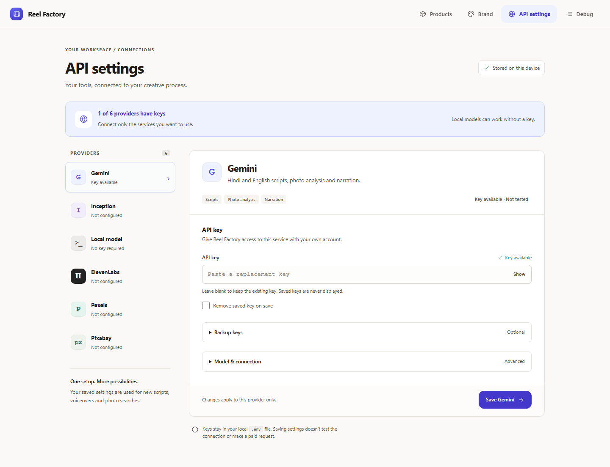](docs/screenshots/07-api-settings.png)

Open **API settings** in the top navigation. Choose a provider, enter a key,
and press that provider's **Save** button. **Model & connection**
holds the model name and server URL where applicable. Blank key fields keep
existing keys; saved secrets are never sent back to the browser.
The overview shows which providers have keys. **Key available** describes stored
configuration; it does not mean a live connection has been tested. On smaller
screens, provider choices appear above the setup panel.

This page writes credentials to `.env` and the relevant non-secret model
settings to `.env` or `brand.yaml`. Saving is configuration, not a connection
test. Gemini supports Hindi generation; Inception is English-only in this app.

### 2. Set the business identity and defaults

[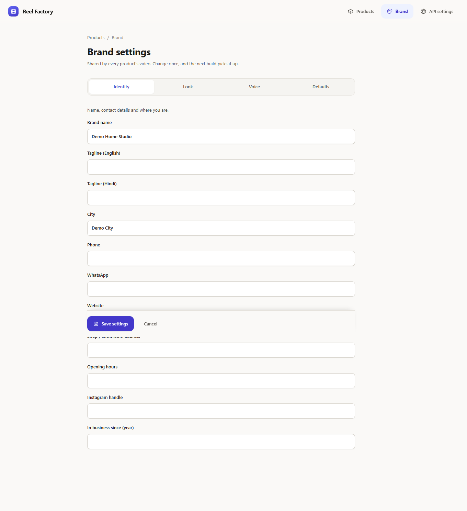](docs/screenshots/08-brand.png)

Use **Brand** for the business name, contact details, visual style and narration
defaults. The tabs separate identity, look, voice and other defaults. Enter real
business facts here because the script's brand mention and call to action use
them. These settings are stored in `brand.yaml` and shared across products.

### 3. Choose one product or a collection

[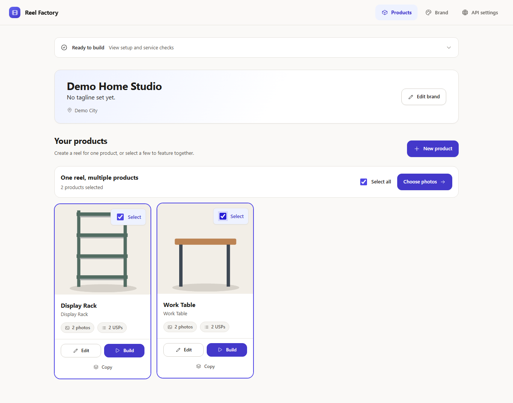](docs/screenshots/01-products.png)

Each card represents a product folder. **Edit** changes its facts/media;
**Build** starts a reel for that product. To introduce several products in one
story, select their cards and press **Choose photos**. The selection count
confirms what is included. The readiness panel describes the current machine;
its status can differ from this screenshot.

### 4. Select exactly which photos enter the collection

[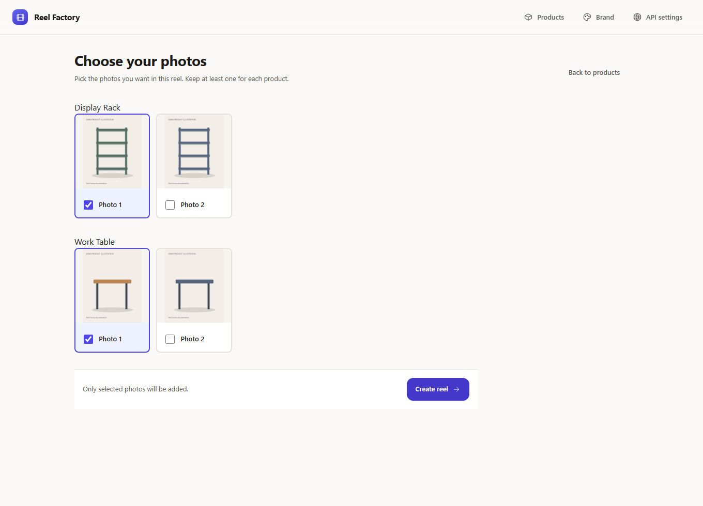](docs/screenshots/02-collection-photos.png)

Keep at least one image per product and deselect views you do not want in the
reel. **Create reel** copies the chosen media and snapshots the selected product
facts into a separate collection draft. The original products remain editable
independently. Those member/media mappings later keep each product scene paired
with one of that product's selected images.

### 5. Keep product information accurate

[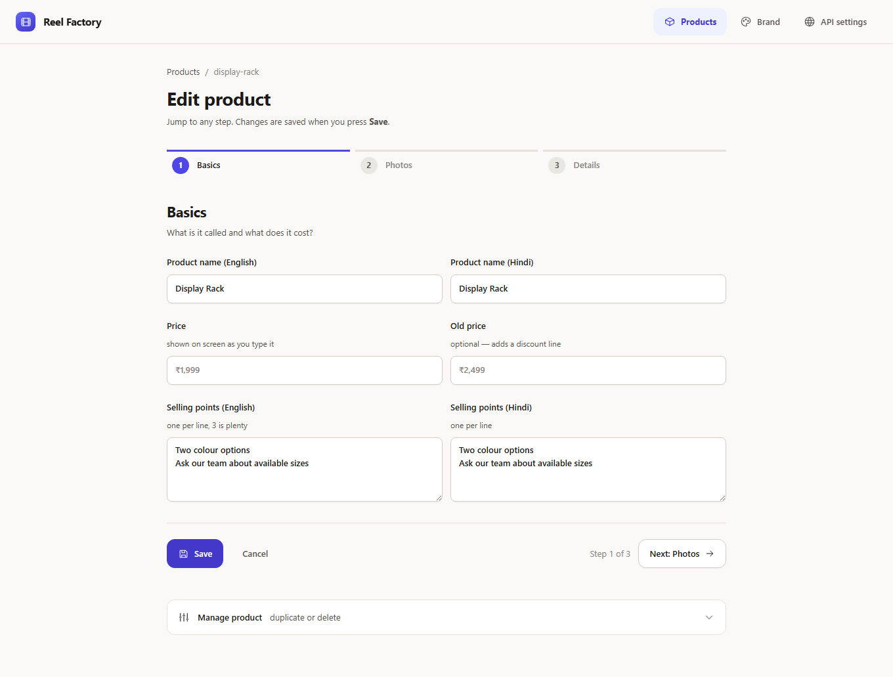](docs/screenshots/03-product-details.png)

The editor separates **Basics**, **Photos** and **Details**. Names identify the
product in each language; the remaining facts, selling points, audience and
intent guide the script. Use supplied facts rather than assumptions: photos
cannot establish a warranty, material grade or performance guarantee.
Press **Save** to persist edits to `product.yaml`.

### 6. Turn photo observations into reusable product context

[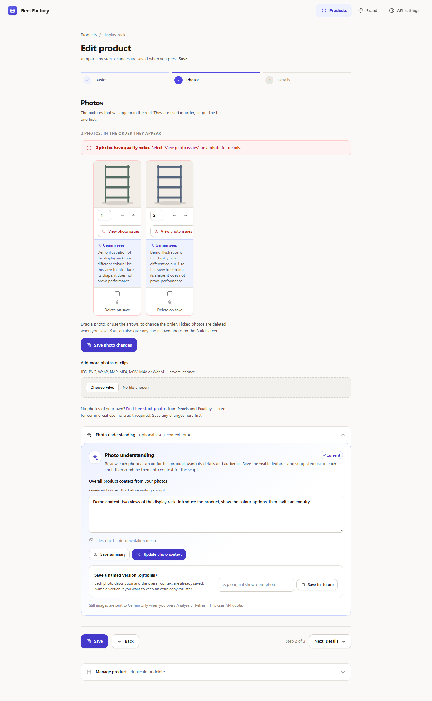](docs/screenshots/04-photo-context.png)

The photo list controls ordering and deletion. **Photo understanding** displays
individual descriptions and the overall product context. In normal use,
**Analyze/Update photo context** sends supported images to Gemini; the example
above instead uses explicitly labelled demo descriptions. Quality notes on the
illustrations are real framing/resolution checks, separate from AI analysis.

Per-photo descriptions and the combined summary live in `photo_analysis.yaml`.
Review the summary, correct it if needed, or save a named version for later.
When image hashes are current, the script writer receives these observations
alongside the product facts. See [Product setup and visual context](#product-setup-and-visual-context)
for the cache and freshness rules.

### 7. Choose the language and script writer

[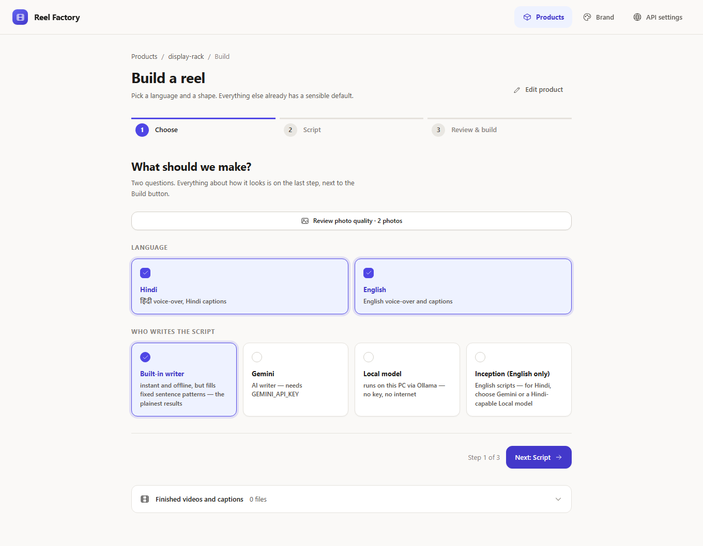](docs/screenshots/05-build-options.png)

Choose the language and script writer here; the product's intent supplies the
purpose. The built-in
writer uses fixed patterns; AI writers receive the shared advertising brief.
Writing a script does not render a video. API configuration, script writer and
narration provider are separate choices, so review each before building.

### 8. Preview the reel and edit its scenes

[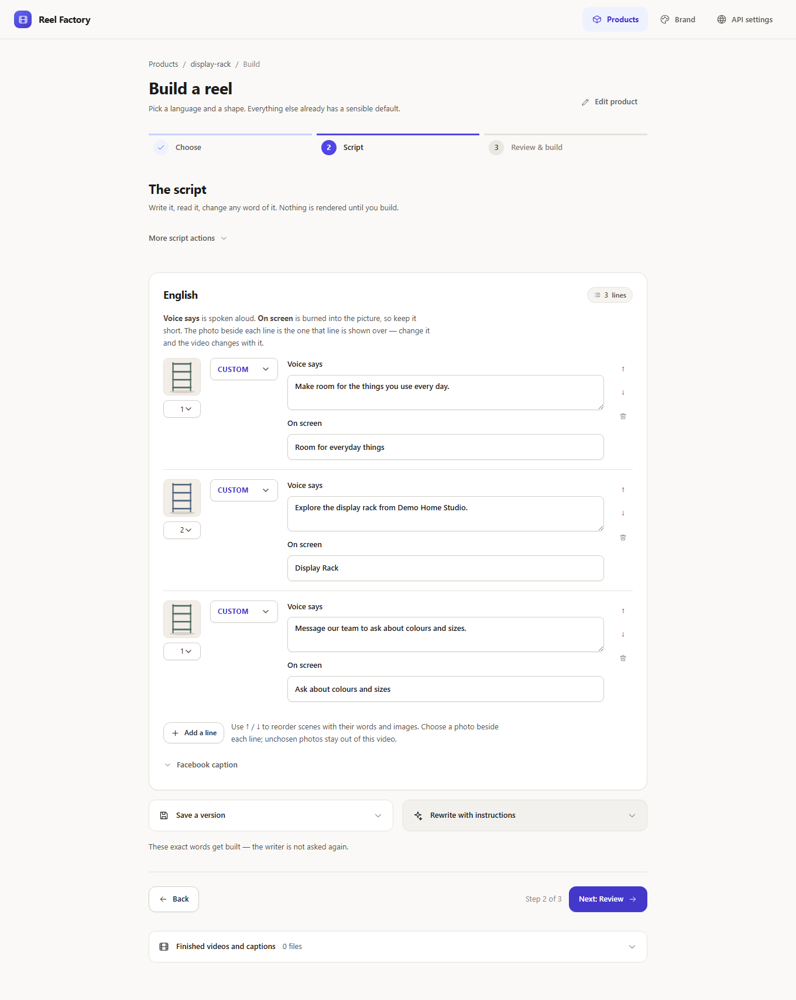](docs/screenshots/06-script-editor.png)

**Voice says** is the narration; **On screen** is the caption burned into the
video. Click **Preview reel** to render and watch the current draft with its
selected voice, captions, transitions and music. Pause the player or jump to a
scene, then click **Edit this scene** to change its picture, narration or caption.
After applying changes, **Refresh preview** renders the updated video. The
preview uses a smaller frame for faster review; the final **Build video** uses
your chosen quality. Previews use the selected voice provider and stay separate
from finished exports. Choose **Voice & video settings** to adjust narration,
music and appearance before previewing.

You can also click a scene thumbnail in the strip or **Edit scene** beside a row to
open a larger picture preview. Choose an existing picture or clip, or use
**Upload picture** or **Upload video**, then **Apply to scene**. Cancel keeps the original
scene choice; uploads remain in the product library. The dropdown beside each
row also selects its image. After applying changes, build the reel again to
include them in the video. The finished-video panel offers **Edit scenes and
rebuild** when an editable script is available.
Reordering a scene moves its copy and photo together. The sample uses explicit
demo script overrides, which is why its roles are labelled **CUSTOM**; it is
not presented as a live AI-generated draft.

Use **Save a version** to preserve the wording and photo selections, or
**Rewrite with instructions** to ask an AI writer for a change. Building an
edited version uses those exact words rather than generating another draft.
This is the place to catch awkward language and unsupported claims.

To insert a video as a new scene, click **Add video scene**, upload an MP4, MOV,
M4V or WebM (or pick one from the video library), add its narration and caption,
then click **Add video scene** in the editor. New videos are inserted before the
closing scene so a template's end card does not hide them. Use **Show media → Videos** to find
clips quickly. Videos keep their own motion and can be mixed with still pictures.
They start at the beginning and are trimmed or looped to fit the scene; the reel
uses your selected narration and music, with the original clip audio muted.
**Refresh preview** lets you watch the mixed reel before building the final video.

### 9. Review the format and narration before rendering

[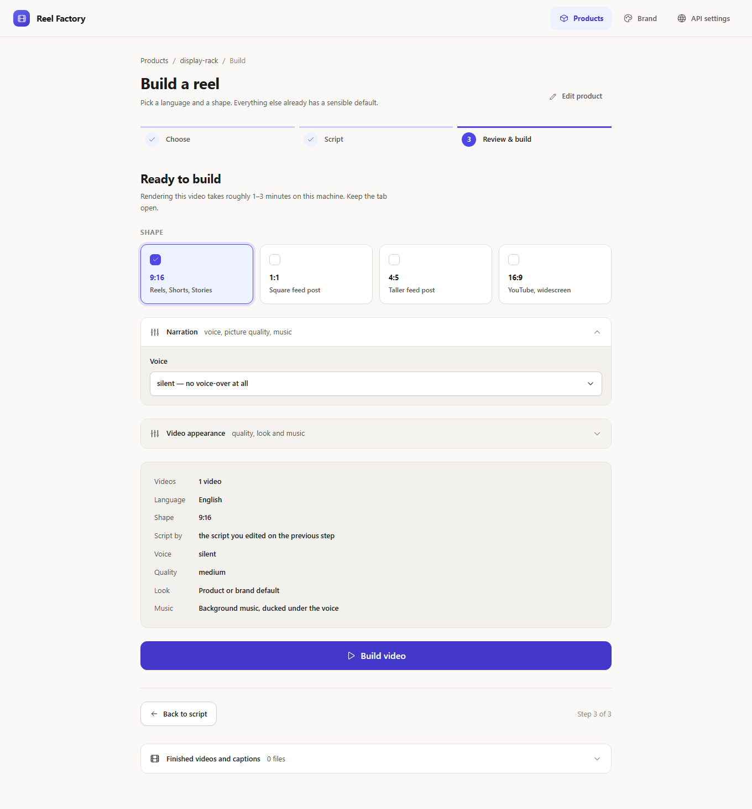](docs/screenshots/09-review.png)

Choose the output shape, narration backend and rendering options, then build.
For a voiced reel, speech is generated per scene and its measured duration
drives image and caption timing. The documentation demo uses **Silent** to
exercise rendering without an external speech request. The finished example
below is a square output; the same pipeline supports the other listed shapes.

### 10. Preview, download and copy the posting caption

[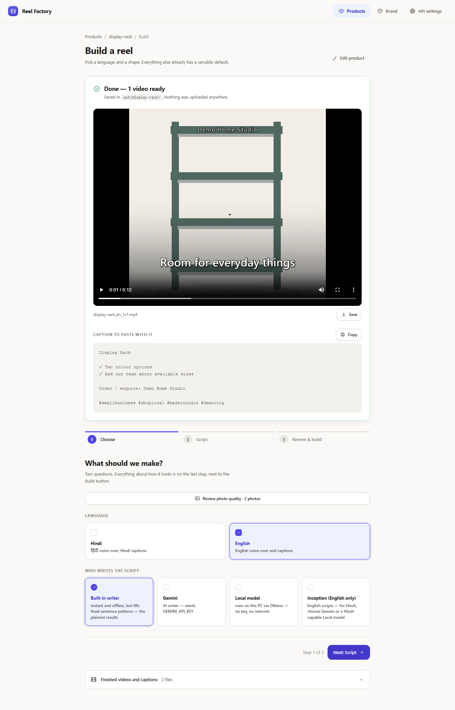](docs/screenshots/10-finished-video.png)

The completed panel contains the playable MP4, a **Save** download action and
the posting caption. Files are stored under `out/<product-slug>/`. This screen
does not publish to a social network; download the result for manual posting
or use the separately configured scheduler workflow.

### Refreshing these screenshots

The reproducible capture script creates a temporary demo workspace, starts the
real Flask app, navigates it with Chromium and renders one silent example:

```powershell
python -m pip install Pillow playwright
python -m playwright install chromium
python scripts/capture_readme.py
```

FFmpeg and ffprobe must also be available. Images are written to
`docs/screenshots/`; the temporary demo products and build are discarded.
The script does not modify your product folders, brand settings or `.env`.

---

## Checking it still works

```text
python -m pip install -r requirements.txt
python -m pytest -o addopts= -q --tb=short
python -m pytest -m "not slow"
python -m pytest tests/test_end_to_end.py
python -m pytest tests/test_scene_editor.py tests/test_reel_preview.py tests/test_video_scenes.py
python -m pytest tests/test_scheduler.py tests/test_regressions_no_ffmpeg.py
```

The complete suite needs FFmpeg **and ffprobe** on PATH. Rendering-dependent
tests skip when those binaries are unavailable, so a green result with skips
is not a full integration check. `not slow` selects a faster subset; some tests
in that subset still require media tools.

The slow ones render real videos and then read the frames back, so a change
that quietly points a line at the wrong photo, or lets a rebuild overwrite
yesterday's video, fails the suite rather than showing up weeks later in
something you posted. Tests work in a temporary folder — your own products and
finished videos are never touched.

Earlier full audit (15 September 2026, Windows / Python 3.12 / FFmpeg 9.0.1):
**297 passed in the final non-slow run, plus all 13 real-render tests passed
in the full run.** The full run also exposed three incomplete Hindi test
fixtures; those fixtures were corrected and passed in the final run.
The separate Chromium walkthrough passed 16 workflow checks. Live service
checks passed for eight of nine features after restarting Ollama and fixing
its response format; Pixabay downloads returned HTTP 429. See the
[full checklist and evidence](FEATURE_CHECKLIST.md).

Repeat the browser and advanced render audits on disposable data:

```text
python -m pip install playwright Pillow
python -m playwright install chromium
python scripts/audit_browser.py
python scripts/audit_scene_editor.py
python scripts/audit_reel_preview.py
python scripts/audit_security_fixes.py
python scripts/audit_render.py
```

The browser audit uses simulated AI/render failures and a real silent
photo-and-clip render. The advanced render audit uses synthetic audio to check
music, effects and end cards. Neither sends cloud requests. Screenshots,
videos and result JSON are written under `out/audit/` (ignored by Git).

The scene editor audit covers media selection, uploads, cancellation, scene
reordering and build handoff. The reel preview audit renders real videos with
silent narration, checks clip uploads and playback, seeks to scenes, edits their
media and words, refreshes the video, and checks desktop/mobile layouts and
error recovery. Their screenshots are in `out/audit/scene-editor/` and
`out/audit/reel-preview/`. Neither audit calls a cloud voice or script provider.
`test_video_scenes.py` also checks moving and looping clips beside still photos
in both previews and full-resolution exports, with source clip audio muted.

Optional live checks **send synthetic data and may consume provider quota**:

```text
python scripts/audit_services.py
python scripts/audit_services.py script-local
```

Configure the appropriate keys first. Local writing also needs a running
model server and a downloaded model; its endpoint must support JSON-schema
structured output. Ollama with `llama3.2:3b` passed the live check. Other local
servers were not verified. See [Ollama structured output support](https://docs.ollama.com/capabilities/structured-outputs).

Additional checks:

```text
python -m compileall -q reelfactory tests
python -m pip check
node --check reelfactory/web/static/app.js
git diff --check
```

Node.js is only needed for that JavaScript syntax check, not to run the app.
See [AUDIT_REPORT.md](AUDIT_REPORT.md) for changes, verification limits,
competitor comparisons, and proposed priorities.

---

## Scheduling (optional)

Once the videos look right, schedule rendering and folder preparation. Actual
social posting remains manual until real platform connectors are implemented.

### The queue

`calendar.yaml` is a plain list you edit yourself. The tool never rewrites it —
status is kept separately in `out/queue_state.json` — so your comments and
ordering survive every run.

```yaml
- product: iron-shelf-5-tier
  lang: hi
  platform: folder
  aspect: '9:16'
  when: 2026-09-07 19:30
  note: first post of the week
```

Generate a starting schedule instead of typing dates:

```
python -m reelfactory plan products --start tomorrow --time 19:30 --days mon,wed,fri --lang hi --platform folder --write calendar.yaml
```

`--write` appends entries; inspect the calendar before repeating the command.
Use local machine time without a timezone suffix. Quote aspect ratios in YAML:
unquoted values such as `4:5` can be parsed as numbers. The loader accepts older
generated ratios for compatibility and rejects unsupported languages or shapes.

Then check it:

```
python -m reelfactory queue
```

### Platforms

| `platform:` | What happens |
|---|---|
| `dryrun` | Logs a simulated publication without uploading; the runner can still render files and records completion in queue state. |
| `folder` | Copies video + caption into `to_post/<date>/` with a tick-list, ready for you to upload |
| `facebook` / `instagram` / `youtube` | Not connected. Fails with a clear message — see `PHASE2.md` |

`folder` is the honest sweet spot: everything is rendered, named and organised
for you, and the thirty seconds of uploading stays under your control. Plenty of
people never move past it.

### Running it

```
python -m reelfactory run                          # publish what is due
python -m reelfactory run --prepare-only           # just render ahead of time
python -m reelfactory run --now "2026-09-07 19:30" # override the clock; still writes files/state
```

`--now` is not a read-only simulation. Use `queue` to inspect the schedule.
For isolated experiments, pass a separate `--calendar`, `--state`, `--out`, and
`--drop`, and choose `dryrun` entries; use `--tts silent --script template` to
avoid cloud generation. Completed dry-run entries are recorded as `published`
with a `dry-run:` result; that status does not mean an upload occurred.

`run` renders anything due in the next two days first, so posting time is not
render time. Re-running is safe: anything already published is left alone.

**To automate it on Windows,** run `schedule_windows.bat` and pick a time. It
registers a daily task and logs to `out/logs/run.log`.

Run it with `dryrun` for a week before connecting anything real. Watch the log,
confirm it picks the right posts at the right times, and only then switch
entries over to `folder`.

### When a run fails

A post that fails for a fixable reason (a missing photo, a bad render) is
retried on the next two runs before being marked failed. A post to a platform
that is not connected fails immediately, because retrying cannot help.

Anything more than 48 hours late is skipped rather than posted, so a laptop
that was switched off for a week does not wake up and fire off a burst of stale
posts. Change that window with `--grace`.
